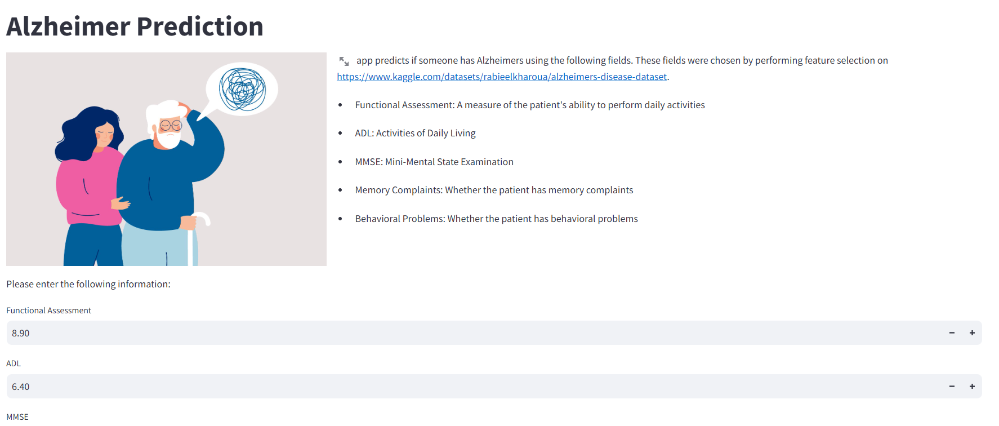
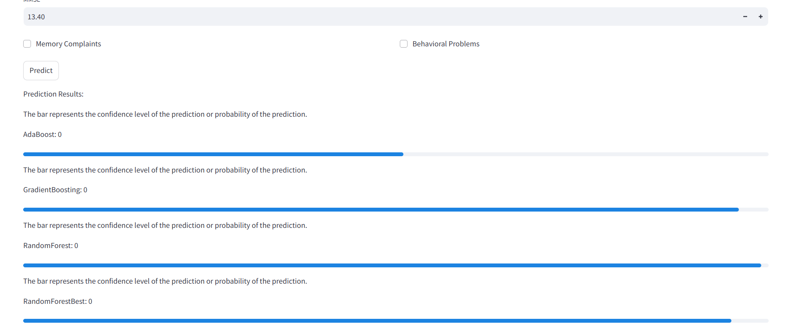

# Alzheimer's Classification

## Description of the Problem
This project aims to classify Alzheimer's disease by training ML models on tabular dataset. Alzheimer's disease is a progressive neurodegenerative disorder. Early and accurate detection is crucial for effective treatment and management. This project utilizes machine learning algorithms to predict if a person has Alzheimer.

## Files present
### Data
The dataset used in this project is committed to the repository. The details are mentioned below:
1. Source of dataset: https://www.kaggle.com/datasets/rabieelkharoua/alzheimers-disease-dataset.
2. Dataset is a csv named `alzheimers_disease_data.csv`.

### Notebook
- `notebook.ipynb`:
  - Data preparation and data cleaning
  - Exploratory Data Analysis (EDA) and feature importance analysis
  - Model selection process and parameter tuning

### Scripts
- `train.py`: Training the final model and saving it to a pickle file.
- `flask_api.py`: To load the model and serve using API.

### Dependencies
- Present in `requirement.txt`

### Dockerfile
A `Dockerfile` is provided to build and run the service in a Docker container.
- build image using: `docker build -t alzheimer-classification .`
- run using: `docker run -p 8501:8501 -p 5000:5000 alzheimer-classification`

### Saved models:
- The .pkl files are saved models (after training).

## Instructions on How to Run the Project

### Prerequisites
- Python 3.x
- Jupyter Notebook
- VS Code
- Pipenv 
- Docker (optional, for deployment)


### Setup
1. Clone the repository:
    ```bash
    git clone https://github.com/vaishnavieieie/Alzheimer-classification.git
    cd Alzheimer-classification
    ```

2. Install dependencies:
    pip install virtualenv
    - Create venv
    ```
    python -m venv venv
    ```
    - Activate environment
        - windows `venv\Scripts\activate`
        - mac `source venv/bin/activate`
        >The commands may vary.
   - Using requirements.txt:
     ```bash
     pip install -r requirements.txt
     ```
    - Deactivate environment if not needed:
    ```
    deactivate
    ```

### Running the Project manually
1. Run the Jupyter Notebook for data preparation, cleaning, EDA, and model selection:
    ```bash
    jupyter notebook notebook.ipynb
    ```
    or run in VS code by installing required dependencies.

2. Train the final model:
    ```bash
    python train.py
    ```

3. Serve the model:
    ```bash
    python flask_api.py
    ```
4. Start the UI:
    ```
    streamlit run app.py
    ```
Interact with the Interface by giving input values and clicking on `predict` button to generate result.

### Deployment
1. Build the Docker image:
    ```bash
    docker build -t alzheimer-classification .
    ```

2. Run the Docker container:
    ```bash
    docker run -p 8501:8501 -p 5000:5000 alzheimer-classification
    ```

3. Access the service at `http://localhost:5000`.
4. Access the interface at `http://localhost:8501/`




